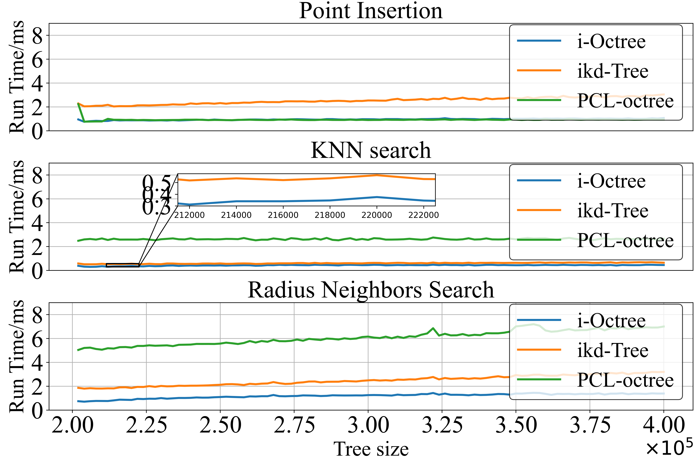

# [i-Octree: A Fast, Lightweight,  and Dynamic  Octree for Proximity  Search(Accepted by ICRA 2024)](https://arxiv.org/abs/2309.08315)

**i-Octree** is a dynamic octree data structure that supports both fast nearest neighbor search and real-time dynamic updates, such as point insertion, deletion, and on-tree down-sampling. The i-Octree is built upon a leaf-based octree and has two key features: a local spatially continuous storing strategy that allows for fast access to points while minimizing memory usage, and local on-tree updates that significantly reduce computation time compared to existing static or dynamic tree structures. 

## Features
- Dynamically insert points to the tree.
- Delete points inside given axis-aligned bounding boxes.
- Fast k-nearest neighbors search.
- Fast radius neighbors search.
- Fully templated for maximal flexibility to support arbitrary point representations & containers.


## Run Randomized Data Experiments

### 1. Build
```bash
git clone git@github.com:zhujun3753/i-octee.git

# For Comparison
cd i-octree
git clone git@github.com:hku-mars/ikd-Tree.git

# Build & Run
bash run.sh

# Plot Results
python plot_time.py

```


###  2. Results




## Attribution

If you use the implementation or ideas from the [corresponding paper](https://arxiv.org/abs/2309.08315) in your academic work, it would be nice if you cite the corresponding paper:
```
@misc{zhu2023ioctree,
      title={i-Octree: A Fast, Lightweight, and Dynamic Octree for Proximity Search}, 
      author={Jun Zhu and Hongyi Li and Shengjie Wang and Zhepeng Wang and Tao Zhang},
      year={2023},
      eprint={2309.08315},
      archivePrefix={arXiv},
      primaryClass={cs.RO}
}
```

## Acknowledgement
Thanks to Jens Behley for open-sourcing his excellent work [octree](https://github.com/jbehley/octree). 

## License

The source code of ikd-Tree is released under [GPLv2](http://www.gnu.org/licenses/old-licenses/gpl-2.0.html) license. For commercial use, please contact Mr. Jun ZHU (<j-zhu20@mails.tsinghua.edu.cn>) or Dr. Tao ZHANG (<taozhang@tsinghua.edu.cn>).
